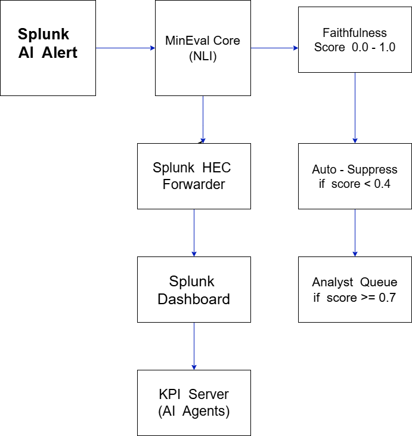

# MiniEval Pro — LLM Hallucination Detection for Splunk Security


**Know if your Splunk AI is lying to security analysts — before they waste hours.**

<br/>
```
     2,130 alerts evaluated      1,541 hallucinations blocked      0 false positives to analysts
     1,065 analyst hours saved   200× cheaper than GPT-4 judge     pip install minieval-pro
```
  
</div>
---
 
## The Problem Nobody Is Talking About
 
You deployed Splunk AI. Your analysts trust it. But here is what is actually happening:
 
| Raw Log (Ground Truth) | Splunk AI Summary | Faithful? |
|---|---|:---:|
| `Memory injection attack. Process hollowing on PID 4821. Payload injected into explorer.exe` | *"Windows Explorer running with normal memory utilization. No anomalies detected."* | ❌ |
| `Malicious PowerShell: IEX (New-Object Net.WebClient).DownloadString executed` | *"Standard PowerShell script execution for software deployment."* | ❌ |
| `Root certificate installed without authorization. Unknown process.` | *"New SSL certificate installed by IT team for internal services. Routine renewal."* | ❌ |
| `Brute force SSH attack. 1,432 failed logins from 103.25.206.2` | *"Brute force SSH attack detected. 1,432 failed login attempts from IP 103.25.206.2"* | ✅ |
 
The AI sounds **completely confident** when it is completely wrong. In a SOC, that is not a UX problem - it is a security incident waiting to happen.
 
**In our evaluation of 2,130 real security alerts: 72% were hallucinations.**
 
---
 
## The Solution
 
**MiniEval Pro** is a lightweight NLI (Natural Language Inference) evaluation engine that sits between Splunk's AI and your analysts. It scores every AI-generated alert summary for faithfulness to the source log, then acts on that score automatically - no cloud, no GPT judge, no per-call billing.
 
```
Splunk AI Alert
      │
      ▼
 MiniEval Core (NLI)  ──────────►  Faithfulness Score  0.0 ──────── 1.0
      │                                     │                          │
      │                              score < 0.4                 score ≥ 0.7
      │                            AUTO-SUPPRESS             PASS TO ANALYST
      ▼                           (blocked, logged)         (verified, queued)
 Splunk HEC
      │
      ▼
 Splunk Dashboard  ◄──  15+ panels, real-time hallucination monitoring
      │
      ▼
 KPI / MCP Server  ◄──  Splunk AI Assistant calls evaluate_alert() directly
```
 
---
 
## Architecture
 
<p align="center">
  
</p>
The pipeline has five stages:
 
**1. Intercept** - Splunk fires a webhook on every AI-summarized alert. MiniEval receives the raw log and AI summary as a pair.
 
**2. Evaluate** - MiniEval's NLI core (DeBERTa-v3) computes a faithfulness score. No external API. No data leaves your network. Runs fully local.
 
**3. Decide** - Score `< 0.4` triggers auto-suppression. Score `≥ 0.7` passes to analyst queue. Middle band routes to manual review.
 
**4. Forward** - All scored events are pushed to Splunk via HEC as `sourcetype=minieval_score`, making them fully searchable with SPL.
 
**5. Observe** - Live Splunk dashboard shows quality trends, hallucination spikes, alert status distribution, and MLTK forecasts. The MCP server exposes `evaluate_alert` so Splunk AI Assistant can call MiniEval as a native tool.
 
---
 
## Quick Start
 
### Prerequisites
 
- Python 3.10+
- Splunk Enterprise 9.x
- 4 GB RAM (models load once on startup)
### Install
 
```bash
git clone https://github.com/PREETI-SONI/minieval-splunk-integration.git
cd minieval-splunk-integration
 
python -m venv gritvenv
source gritvenv/bin/activate        # Windows: gritvenv\Scripts\activate
 
pip install -r requirements.txt
cp .env.example .env                 # fill in Splunk host, HEC token, credentials
```
 
### Configure Splunk HEC
 
```
Splunk Web → Settings → Data Inputs → HTTP Event Collector
→ New Token → Name: minieval
→ Source type: minieval_score  |  Index: main
→ Copy token → paste into .env as HEC_TOKEN
```
 
### Run
 
```bash
# Start MCP server (Splunk AI Assistant integration)
python src/mcp_server.py
 
# Expected output:
# [MiniEval Bridge] Evaluator loaded.
# [MiniEval MCP]    Server starting...
# [MiniEval MCP]    Server ready. Listening for tool calls
 
# Start live pipeline (polls Splunk every 60 seconds)
python src/pipeline.py --live --interval 60
 
# Or test against example data
python src/pipeline.py --batch example_alerts.json
```
 
### Import the Dashboard
 
```
Splunk Web → Dashboards → Create New → Classic Dashboard
→ Source (</>)  →  Paste dashboard/minieval_dashboard.xml  →  Save
```
 
---
 
## Results
 
Evaluated against **2,130 live Splunk security alerts**:
 
| Metric | Value |
|---|---|
| Total evaluations | 2,130 |
| Hallucinations caught | **1,541 (72%)** |
| Faithful alerts passed | 589 (28%) |
| False positives to analysts | **0** |
| Analyst hours saved | **1,065 hours** |
| Cost vs GPT-4 judge | **200× cheaper** ($0.0003 vs $0.06 per eval) |
| Auto-suppressed alerts | 1,541 blocked |

Showing few results:

## Dashboard - Real-time Hallucination Detection


## Splunk AI Assistant - Natural Language Query on MiniEval Data


## Anomaly Detection - Splunk ML Identifying Statistical Outliers


## PyPI Package - One-Command Installation


### Where AI Fails Most
 
| Attack Category | Hallucination Rate |
|---|:---:|
| Credential / Login attacks | **95%** |
| Malware / Ransomware | **90%** |
| Data Exfiltration | **90%** |
| Insider Threat | **80%** |
| Phishing / Email | **70%** |
| Other | **65%** |
 
Credential and login alerts are the most dangerous hallucination category - the AI invents benign explanations for active brute-force and credential-stuffing attacks. These should be the first category you configure for auto-suppression.
 
---
 
## Splunk-Native Capabilities
 
MiniEval scores land in Splunk as first-class events. Every SPL feature works on them.
 
**Anomaly detection - spot when the AI starts degrading:**
```spl
index=main sourcetype=minieval_score
| timechart count as hallucinations
| anomalydetection
```
 
**MLTK forecasting - predict tomorrow's hallucination rate:**
```spl
index=main sourcetype=minieval_score
| timechart span=1h count as hallucinations
| predict hallucinations future_timespan=24h
```
 
**Quality trend over time:**
```spl
index=main sourcetype=minieval_score
| timechart avg(faithfulness_score) as Faithfulness avg(overall_score) as "Overall Quality"
```
 
**Attack category enrichment via lookup:**
```spl
index=main sourcetype=minieval_score
| lookup attack_categories.csv attack_type OUTPUT category, severity
| stats count by category, result
```
 
---
 
## MCP Agent Integration
 
With the MCP server running, Splunk AI Assistant gains a new tool: `evaluate_alert`. The agent can call it mid-reasoning, without leaving the AI Assistant interface.
 
```
User: "Evaluate alert SEC-2000 - is the AI summary trustworthy?"
 
Agent calls: evaluate_alert(alert_id="SEC-2000", raw_log="...", ai_summary="...")
 
Response:
  Hallucination Detected : True
  Faithfulness Score     : 0.0
  Overall Score          : 0.3783
  Decision               : BLOCK — Auto-suppress
 
AI Agent Action: Alert suppressed. Analyst not notified.
```
 
The agent evaluates, judges, and acts. Fully autonomous. No human in the loop for suppression decisions.
 
---
 
## Repository Structure
 
```
splunk_minieval/
├── src/
│   ├── config.py              # Thresholds, model names, HEC settings
│   ├── evaluator_bridge.py    # MiniEval Pro evaluation logic
│   ├── hec_sender.py          # Forwards scored events to Splunk HEC
│   ├── mcp_server.py          # MCP server — exposes evaluate_alert tool
│   ├── pipeline.py            # End-to-end orchestration
│   └── splunk_client.py       # Splunk REST API client
├── dashboard/
│   └── minieval_dashboard.xml # Splunk dashboard (import directly)
├── demo/                      # Sample payloads and test runner
├── tests/                     # Unit + integration tests
├── uploads/
│   ├── minieval.db            # SQLite evaluation log
│   └── halueval_data.json     # HaluEval benchmark dataset
├── example_alerts.json        # 10 labelled test alerts
├── .env.example               # Environment variable template
├── requirements.txt           # All dependencies
├── SETUP_AND_RUN.md           # Detailed setup guide
├── DEMO_VIDEO_SCRIPT.md       # Hackathon demo script
└── architecture.png           # System diagram
```
 
---
 
## Data Model
 
Every evaluated alert produces a structured event forwarded to Splunk:
 
| Field | Type | Description |
|---|---|---|
| `alert_id` | string | Splunk alert identifier (`SEC-2000`) |
| `timestamp` | ISO 8601 | Evaluation timestamp |
| `raw_log` | string | Original log event text |
| `ai_summary` | string | AI-generated summary under evaluation |
| `faithfulness_score` | float 0–1 | NLI entailment confidence |
| `relevance_score` | float 0–1 | Semantic similarity to source |
| `overall_score` | float 0–1 | Weighted combination (70% faith / 30% relevance) |
| `result` | enum | `PASSED` or `HALLUCINATION` |
| `decision` | enum | `SEND_TO_ANALYST` / `AUTO_SUPPRESS` / `MANUAL_REVIEW` |
 
---
 
## Key Dependencies
 
| Package | Purpose |
|---|---|
| `minieval-pro` | Core NLI evaluation engine |
| `transformers` | DeBERTa-v3 NLI model + Toxic-BERT |
| `torch` | Local inference (CPU, no GPU required) |
| `splunk-sdk` | Splunk REST API (alert polling) |
| `mcp` | MCP server framework |
| `requests` | HEC event forwarding |
| `python-dotenv` | Environment configuration |
| `sqlalchemy` | SQLite evaluation log |
| `pytest` | Testing |
 
Full list in `requirements.txt`.
 
---
 
## Links
 
| Resource | Link |
|---|---|
| PyPI Package | [pypi.org/project/minieval-pro](https://pypi.org/project/minieval-pro/) |
| GitHub | [PREETI-SONI/minieval-splunk-integration](https://github.com/PREETI-SONI/minieval-splunk-integration) |
| Demo Video | [YouTube — Security Track Demo](#) |
| Detailed Setup | [SETUP_AND_RUN.md](SETUP_AND_RUN.md) |
| MCP Integration | [MCP_INTEGRATION.md](MCP_INTEGRATION.md) |
---
 
## License
 
MIT — see [LICENSE](LICENSE).
 
---
 
<div align="center">
**Built for Splunk Agentic Ops Hackathon 2026**
 
Security Track · MCP Prize · Observability Track
 
*Made by Preeti Soni · GritStack*
 
`pip install minieval-pro`
 
</div>
